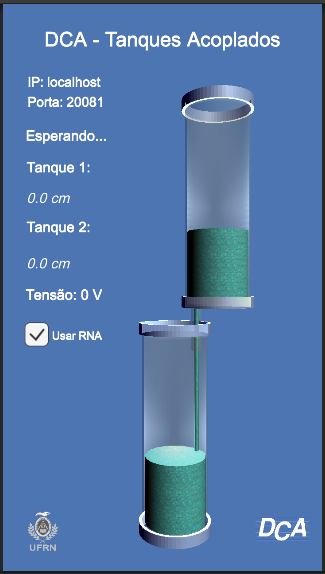
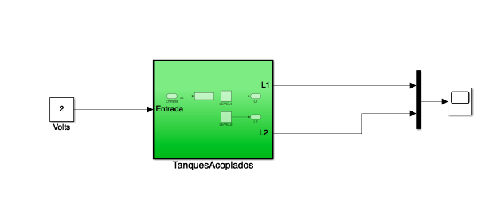

# simulador-tanques-acoplados-app

## Simulador de Tanques Acoplados Quaser com driver de comunicação via Simulink - MATLAB.

### Passos Para Utilizar

1. Instale o app .apk que se encontra na pasta *simulador-app* no seu dispositivo Android.
2. Executar o app. A simulação informa o endereço de IP e a porta utilizada para comunicação. 
3. Execute o MATLAB. Abra todos os arquivos .m da pasta *matlab-files*.
4. No script *run_coupled_tanks*, ajustar o campo *ip* para o IP que aparece no app em execução.
5. No script *run_coupled_tanks*, ajustar o campo *simulation_time* para o tempo de execução, em segundos, desejado.
6. Executa o script: *run_coupled_tanks.m*. Para que o script funcione de maneira adequada, é necessário executar todos os outros arquivos .m antes. 
7. A simulação será iniciada.

#### Planta Base no Simulink

### Para realizar incrementos na planta base

1. Pause a simulação no MATLAB se estiver em execução.
2. Na simulação *coupled_tanks_sim.slx*, adicione elementos como ganhos, somadores, bloco PID, etc.
3. Salve a simulação.
4. Execute o script *run_coupled_tanks.m* novamente.

#### **OBS**: Não alterar os blocos da simulação base presentes no *subsystem* TanquesAcoplados.